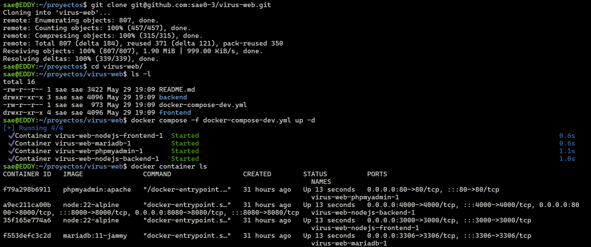
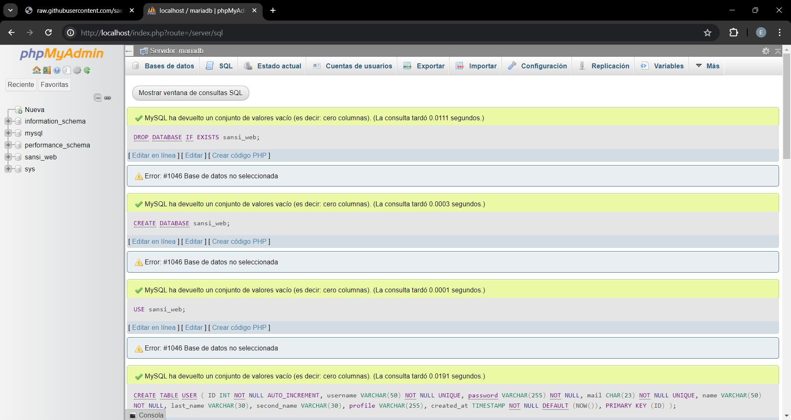
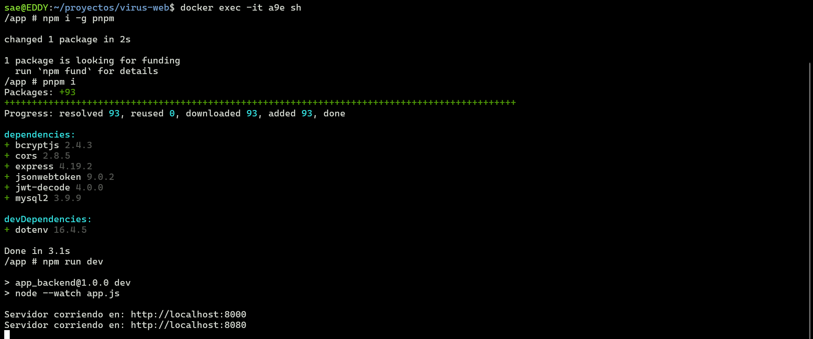
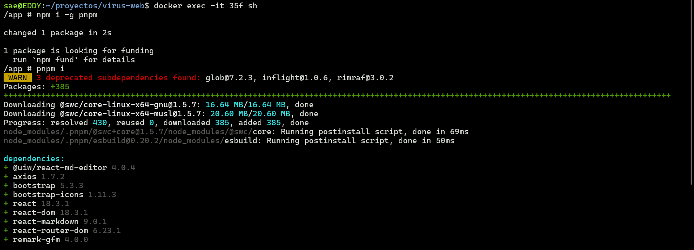
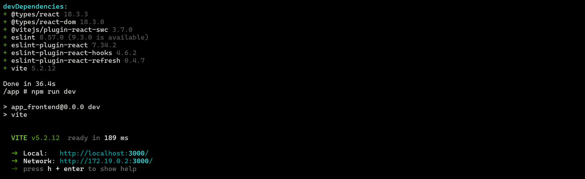

# PLATAFORMA DE DEBATE/AYUDA ESTUDIANTIL `SANSI-WEB`
### GRUPO: VIRUS

****
## TABLA DE CONTENIDO
* [ACTUALIZACIÓN FINAL](#actualizacion)
  * [Descripcion](#descripcion)
  * [Foro Principal](#foro-principal)
  * [Anuncios](#anuncios)
  * [Chats](#chats)
* [HACER CORRER](#hacer-correr)
  * [Requisitos](#requisitos)
  * [Desarrollo](#desarrollo)
  * [Produccion](#produccion)
* [RECURSOS](#recursos)


****
<a name="actualizacion"></a>
## ACTUALIZACIÓN FINAL

Debido a la retroalimentación recibida durante las revisiones hemos cambiado un poco el enfoque del proyecto, antes era una pagina que tenia el objetivo de servir como apoyo a los estudiantes y sus materias, haciendo el uso del foro, seccion de anuncios de ayudantia y chat personalizado.

**Ahora el sistema consiste en ayudar a los estudiantes a encontrar trabajo mediante la aplicación de una API de construcción propia, que extrae información de las principales empresas informáticas del país, como por ejemplo: Jalasoft, UnoSquere, Digital Harbor, etc., y las presenta en una lista para ser consultada por los estudiantes de la UMSS. Además, se usa una API de geolocalización para entregar mejores resultados de acuerdo a la ubicación del estudiante.**

<a name="descripcion"></a>
### Caracteristicas del sistema

- Seccion de anuncios, muestra open positions de las principales empresas del pais(escalable)
- Sección de Foro, para compartir experiencias sobre encontrar trabajo.
- Chat directo entre estudiantes sirve para crear contactos fuera de la Universidad
- Uso de APIs propias y externas para la recuperacion de datos
- Sistema de loguin que verifica estudiantes de la UMSS (Sistema de autentificación)
- Backend SQL para el sistema de loguin y mensajeria.
- Proyecto Dockerizado listo para el Deploy en la nube (incluye las dependencias necesarias)
- Uso de proxys y reverse proxys para la resolucion de problemas de conexión
- Pagina responsive lista para dispositivos moviles y otros.

**Tecnologias usadas:**
- Frontend: React, Vite, Material-UI, Axios
- Backend: Node.js, Express.js, JWT
- Base de Datos: MySQL
- Docker, WSL

<a name="descripcion"></a>
### Descripcion

~~El sistema consiste en un foro/red social para preguntas referentes a ayudas academicas u otros temas relacionados a la universidad.~~

Al sistema podran registrase con el codigo sis y el proceso sera el siguiente:

- El nuevo usuario introduce su codigo sis
- El sistema envia un mensaje para confirmar el codigo sis a su correo institucional sis_proporcionado@est.umss.edu
- Para seguir con el registro el usuario debera de entrar al link que se le envio a su correo, de no hacerlo no podra seguir con el registro

<a name="foro-principal"></a>
### Foro Principal

Esta seccion va dirigido a la publicacion de hilos/posts de conversacion sobre temas puntuales, un post puede tener un titulo, diferentes tipos de etiquetas (relacionados al tema del que habla el post al estilo de reddit) y una descripcion.

Estos hilos podran estar en dos estados, activo o cerrado, si esta cerrado nadie mas podra comentar hasta que no se vuelva a abrir.

Por otra parte podran remarcarse (agregar algun tipo de distintivo) aquellas respuestas que agreguen mas valos a los posts.

<a name="anuncios"></a>
### Anuncios

En esta seccion se mostraran los puestos de trabajo disponibles en las empresas de la ciudad, con la posibilidad de filtrar por empresa y ubicacion.

Esta seccion hace un request a una API que extrae los datos necesarios para armar una lista de empleos, disponibles en las paginas web de las principales empresas de tecnologia del Pais, y se filtran solo los datos que se requieren (Mejorable).

Para mejorar los resultados de busqueda se usa otra API de geolocalizacion por ip lo que proporciona un filtro mas para los resultados del usuario.

Ademas contiene un buscador que buscara cualquiere coincidencia mostrando todos los resultados mientras se escriben las palabras.

Nota: La informacion de los puestos de trabajo se actualiza diariamente y una vez al dia para su recuperacion.

<a name="chats"></a>
### Chats

De momento solo se podran enviar texto.

No existira grupos, solo chats privados.


****
<a name="hacer-correr"></a>
## HACER CORRER

<a name="requisitos"></a>
### Requisitos
  * Tener docker instalado (para windows [wsl2](https://learn.microsoft.com/es-es/windows/wsl/install))

<a name="desarrollo"></a>
### Desarrollo
1. Clonar el repositorio
```hs
git clone git@github.com:sae0-3/virus-web.git
```

2. Entrar al proyecto
```hs
cd virus-web/
ls -l
```

3. Construir el contenedor
```hs
docker compose -f docker-compose-dev.yml up -d
```

4. Subir la base datos /backend/structure.sql (phpmyadmin activado en el puerto 80: `http://localhost`)

5. Identificar el id que se proporciono a los contenedores de node (`virus-web-nodejs-frontend-1` y `virus-web-nodejs-backend-1`)
```hs
docker container ls
```

6. Ingresar a la terminal interactiva de `virus-web-nodejs-backend-1`
```hs
docker exec -it <id_container> sh
```

7. Instalar pnpm (opcional)
```hs
npm install -g pnpm
```

8. Instalar los paquetes de desarrollo (de no haber instalado pnpm se usa npm)
```hs
pnpm install
```

9. Hacer correr el servidor de desarrollo
```hs
npm run dev
```

10. Abrir otra terminal

11. Volver al paso 3 y ahora hacerlo para `virus-web-nodejs-frontend-1`

12. Eliminar los contenedores
```hs
docker compose -f docker-compose-dev.yml down
```

****

****

****

****


****

<a name="produccion"></a>
### Produccion
Ejecutar:

```hs
docker compose up -d
```

****
<a name="recursos"></a>
## RECURSOS
* https://discuss.jsonapi.org/
* https://forum.codeselfstudy.com/
* https://medium.com/@mubashirhussain29/the-screaming-architecture-story-08750691291f

#### MARKDOWN
  * https://commonmark.org/
  * https://www.markdownguide.org/basic-syntax/

#### DOCKER
  * https://imaginaformacion.com/tutoriales/que-es-docker-compose

#### WSL2
  * https://youtu.be/3Tkkk3ePZKo?si=VU8f3UJ_zrznv3nx

#### JS
  * https://developer.mozilla.org/es/docs/Web/JavaScript/Reference/Operators/Destructuring_assignment
