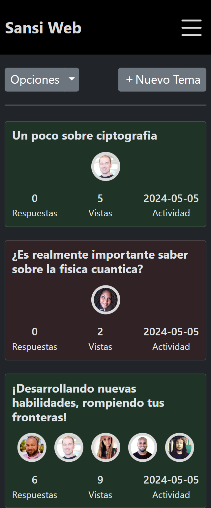
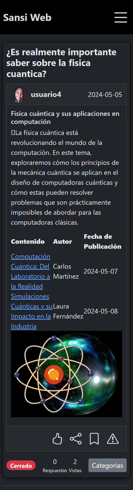
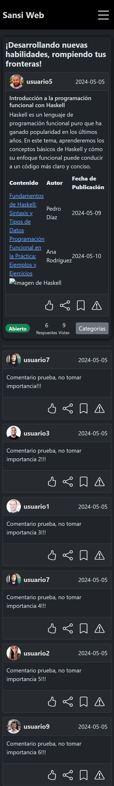

## Vista Previa

  
  
  
  

  
  
  

****

## Recursos
  * https://www.copycat.dev/blog/react-markdown/
  * https://uiwjs.github.io/react-md-editor/
  * https://www.freecodecamp.org/espanol/news/tutorial-de-react-router-version-6-como-navegar-a-otros-componentes-y-configurar-un-enrutador/
  * https://puesenmiordenadorfunciona.blogspot.com/2020/09/dockerizando-una-aplicacion-react.html
