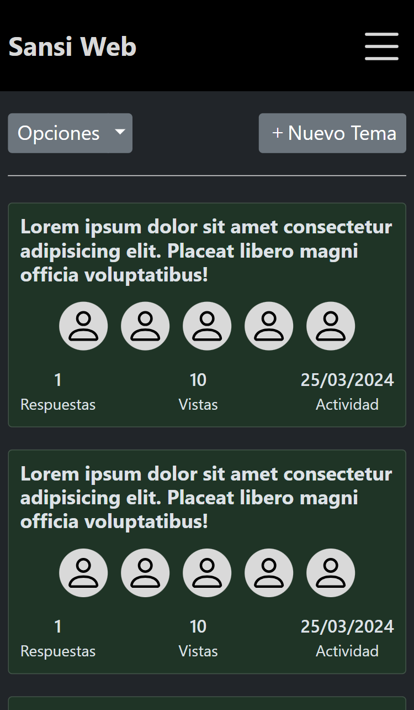
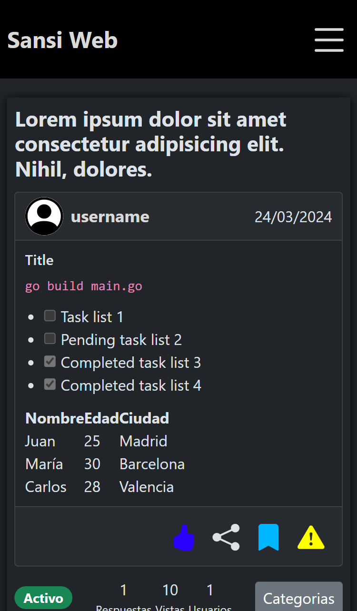
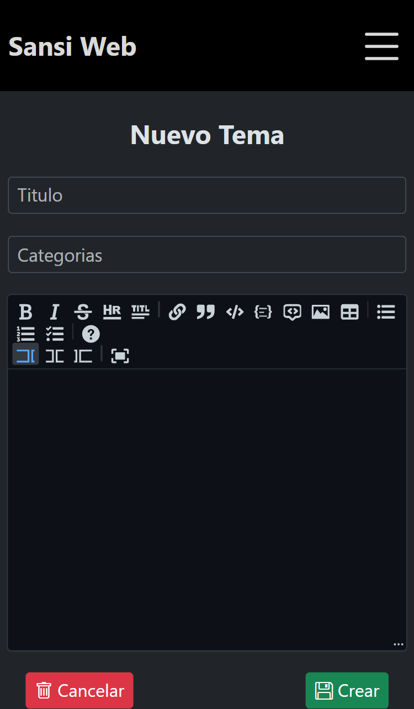

### Vista Previa

<div class="imagenes" style="display:flex; flex-wrap:wrap; justify-content:space-between;">
  
  
  
  
</div>

#### Requisitos previos
  * Tener docker instalado (wsl2 en caso de tener windows)

#### Hacer correr

  1. Construir el contenedor
  ```hs
  docker compose up -d
  ```

  2. Ver el id que se proporciono al contenedor
  ```hs
  docker container ls
  ```

  3. Ingresar a la terminal interactiva
  ```hs
  docker exec -it <id_container> sh
  ```

  4. Instalar pnpm (opcional)
  ```hs
  npm install -g pnpm
  ```

  5. Instalar los paquetes de desarrollo (de no haber instalado pnpm se usa npm)
  ```hs
  pnpm install
  ```

  6. Hacer correr el servidor de desarrollo
  ```hs
  npm run dev
  ```

  7. Salir de la terminal interactiva
  ```hs
  exit
  ```

  8. Eliminar el contenedor y la red asociada
  ```hs
  docker compose down
  ```

#### Recursos
  * https://www.copycat.dev/blog/react-markdown/
  * https://uiwjs.github.io/react-md-editor/
  * https://www.freecodecamp.org/espanol/news/tutorial-de-react-router-version-6-como-navegar-a-otros-componentes-y-configurar-un-enrutador/
  * https://puesenmiordenadorfunciona.blogspot.com/2020/09/dockerizando-una-aplicacion-react.html
